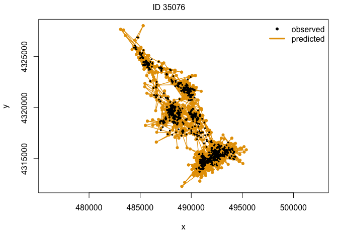
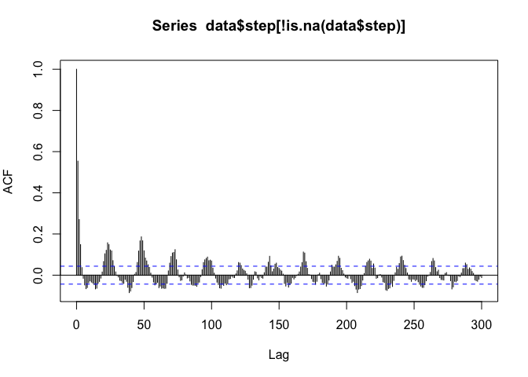
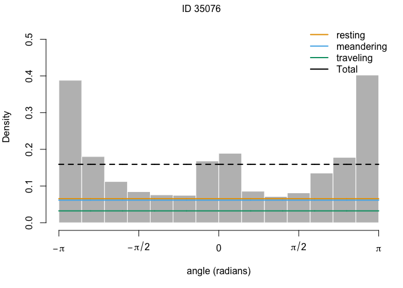
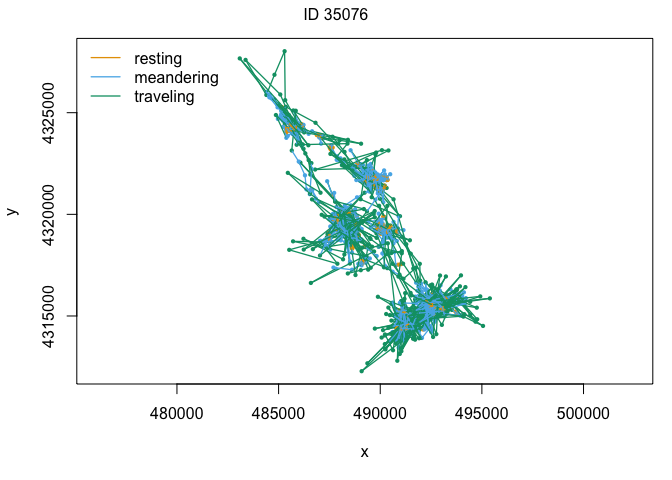
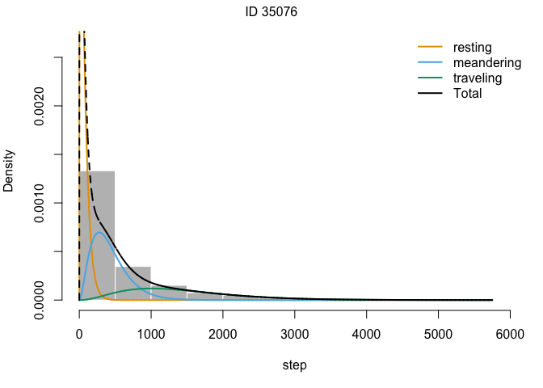
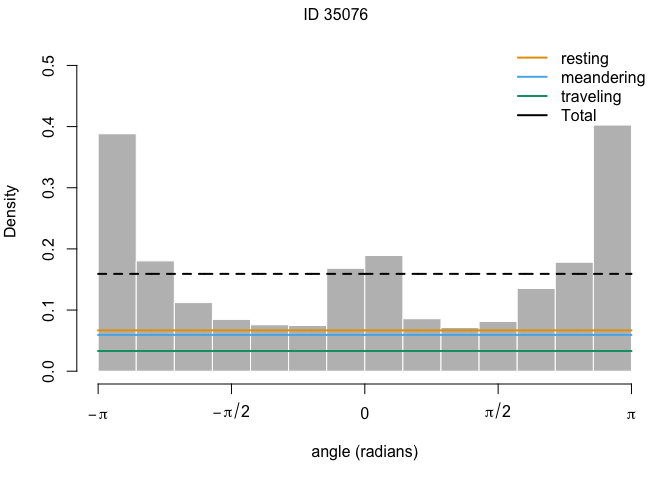
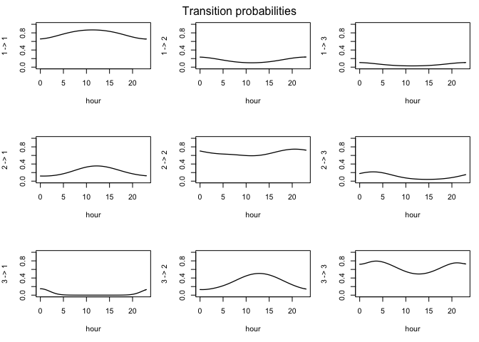
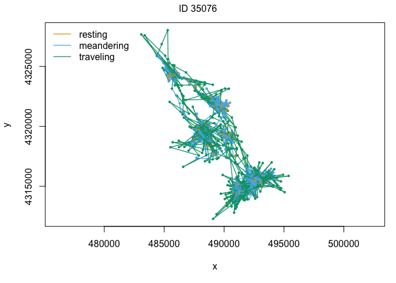

HMM
================
Amy Van Scoyoc
3/30/2022

``` r
library(here)
```

    ## here() starts at /Users/Amy/Documents/Berkeley Classes/Brashares Lab/projects/coyote-movement

``` r
library(tidyverse)
```

    ## ── Attaching packages ─────────────────────────────────────── tidyverse 1.3.1 ──

    ## ✓ ggplot2 3.3.5     ✓ purrr   0.3.4
    ## ✓ tibble  3.1.6     ✓ dplyr   1.0.7
    ## ✓ tidyr   1.1.4     ✓ stringr 1.4.0
    ## ✓ readr   2.0.2     ✓ forcats 0.5.1

    ## ── Conflicts ────────────────────────────────────────── tidyverse_conflicts() ──
    ## x dplyr::filter() masks stats::filter()
    ## x dplyr::lag()    masks stats::lag()

``` r
library(ggplot2)
library(imager)
```

    ## Loading required package: magrittr

    ## 
    ## Attaching package: 'magrittr'

    ## The following object is masked from 'package:purrr':
    ## 
    ##     set_names

    ## The following object is masked from 'package:tidyr':
    ## 
    ##     extract

    ## 
    ## Attaching package: 'imager'

    ## The following object is masked from 'package:magrittr':
    ## 
    ##     add

    ## The following object is masked from 'package:stringr':
    ## 
    ##     boundary

    ## The following object is masked from 'package:tidyr':
    ## 
    ##     fill

    ## The following objects are masked from 'package:stats':
    ## 
    ##     convolve, spectrum

    ## The following object is masked from 'package:graphics':
    ## 
    ##     frame

    ## The following object is masked from 'package:base':
    ## 
    ##     save.image

``` r
library(sp)
```

    ## 
    ## Attaching package: 'sp'

    ## The following object is masked from 'package:imager':
    ## 
    ##     bbox

``` r
library(plyr)
```

    ## ------------------------------------------------------------------------------

    ## You have loaded plyr after dplyr - this is likely to cause problems.
    ## If you need functions from both plyr and dplyr, please load plyr first, then dplyr:
    ## library(plyr); library(dplyr)

    ## ------------------------------------------------------------------------------

    ## 
    ## Attaching package: 'plyr'

    ## The following object is masked from 'package:imager':
    ## 
    ##     liply

    ## The following objects are masked from 'package:dplyr':
    ## 
    ##     arrange, count, desc, failwith, id, mutate, rename, summarise,
    ##     summarize

    ## The following object is masked from 'package:purrr':
    ## 
    ##     compact

    ## The following object is masked from 'package:here':
    ## 
    ##     here

``` r
library(move)
```

    ## Loading required package: geosphere

    ## Loading required package: raster

    ## 
    ## Attaching package: 'raster'

    ## The following object is masked from 'package:magrittr':
    ## 
    ##     extract

    ## The following object is masked from 'package:dplyr':
    ## 
    ##     select

    ## The following object is masked from 'package:tidyr':
    ## 
    ##     extract

    ## Loading required package: rgdal

    ## rgdal: version: 1.5-18, (SVN revision 1082)
    ## Geospatial Data Abstraction Library extensions to R successfully loaded
    ## Loaded GDAL runtime: GDAL 3.1.4, released 2020/10/20
    ## Path to GDAL shared files: /Library/Frameworks/R.framework/Versions/4.0/Resources/library/rgdal/gdal
    ## GDAL binary built with GEOS: TRUE 
    ## Loaded PROJ runtime: Rel. 6.3.1, February 10th, 2020, [PJ_VERSION: 631]
    ## Path to PROJ shared files: /Library/Frameworks/R.framework/Versions/4.0/Resources/library/rgdal/proj
    ## Linking to sp version:1.4-4
    ## To mute warnings of possible GDAL/OSR exportToProj4() degradation,
    ## use options("rgdal_show_exportToProj4_warnings"="none") before loading rgdal.

``` r
library(rgdal)
library(lubridate)
```

    ## 
    ## Attaching package: 'lubridate'

    ## The following objects are masked from 'package:raster':
    ## 
    ##     intersect, union

    ## The following objects are masked from 'package:base':
    ## 
    ##     date, intersect, setdiff, union

``` r
library(adehabitatLT)
```

    ## Loading required package: ade4

    ## Loading required package: adehabitatMA

    ## Registered S3 methods overwritten by 'adehabitatMA':
    ##   method                       from
    ##   print.SpatialPixelsDataFrame sp  
    ##   print.SpatialPixels          sp

    ## 
    ## Attaching package: 'adehabitatMA'

    ## The following object is masked from 'package:raster':
    ## 
    ##     buffer

    ## The following object is masked from 'package:plyr':
    ## 
    ##     join

    ## Loading required package: CircStats

    ## Loading required package: MASS

    ## 
    ## Attaching package: 'MASS'

    ## The following objects are masked from 'package:raster':
    ## 
    ##     area, select

    ## The following object is masked from 'package:dplyr':
    ## 
    ##     select

    ## Loading required package: boot

    ## 
    ## Attaching package: 'adehabitatLT'

    ## The following object is masked from 'package:move':
    ## 
    ##     burst

    ## The following object is masked from 'package:plyr':
    ## 
    ##     id

    ## The following object is masked from 'package:dplyr':
    ## 
    ##     id

``` r
library(setRNG)
library(momentuHMM)
```

    ## momentuHMM 1.5.4 (2021-09-02)

``` r
#import 2021-2022 data
data <- read_csv("/Users/Amy/Documents/Berkeley Classes/Brashares Lab/projects/coyote-movement/data/coyote_2021.12.01_2022.03.04.csv") %>% 
  drop_na(`Longitude[deg]`) %>% #remove any empty locations
  dplyr::select(ID = `Collar ID`, time = `Acq. Time [UTC]`, #select & rename columns
                x = `Longitude[deg]`, y = `Latitude[deg]`) %>%  
  mutate(time = lubridate::with_tz(ymd_hms(time, tz="UTC"), tzone = "America/Los_Angeles"))
```

    ## Rows: 8328 Columns: 16
    ## ── Column specification ────────────────────────────────────────────────────────
    ## Delimiter: ","
    ## chr  (3): Origin, Fix Type, Mortality Status
    ## dbl  (8): Collar ID, Latitude[deg], Longitude[deg], Altitude[m], DOP, Temp[°...
    ## lgl  (2): 3D Error, Activity
    ## dttm (3): Acq. Time [UTC], Acq. Time [LMT], SCTS [UTC]
    ## 
    ## ℹ Use `spec()` to retrieve the full column specification for this data.
    ## ℹ Specify the column types or set `show_col_types = FALSE` to quiet this message.

``` r
head(data)
```

    ## # A tibble: 6 × 4
    ##      ID time                    x     y
    ##   <dbl> <dttm>              <dbl> <dbl>
    ## 1 35076 2022-03-03 15:00:38 -123.  39.0
    ## 2 35074 2022-03-03 15:00:19 -123.  39.0
    ## 3 35074 2022-03-03 14:00:23 -123.  39.0
    ## 4 35076 2022-03-03 14:00:22 -123.  39.0
    ## 5 35074 2022-03-03 13:00:33 -123.  39.0
    ## 6 35076 2022-03-03 13:00:27 -123.  39.0

``` r
#for single individual
data <- subset(data,ID==unique(ID)[1])

#transform to sp object
llcoord <- SpatialPoints(data[,3:4],proj4string=CRS("+init=epsg:4326"))
#transform to utms
utmcoord <- spTransform(llcoord,CRS("+init=epsg:26910"))
# add UTM locations to data frame
data$x <- attr(utmcoord,"coords")[,1]
data$y <- attr(utmcoord,"coords")[,2]
```

``` r
#get percent of missing locations
# int_missing <- interval("2021-12-08", "2022-03-04") #define an interval for this period
# miss_period <- rawData[rawData$time %within% int_missing,] #subset rawData to times in this period
# no_days <- as.numeric(as.Date("2022-03-04")-as.Date("2021-12-08")) #get the number of days
# 
# length(miss_period$time)/(no_days*24) #2% of data is missing
```

``` r
set.seed(12345)

# fit crawl model
crwOut <- crawlWrap(obsData=data, timeStep="hour",theta=c(6.855, -0.007), 
                    fixPar=c(NA,NA), attempts = 10, retryFits = 50)
```

    ## Fitting 1 track(s) using crawl::crwMLE...

    ## crawl 2.2.1 (2018-09-12) 
    ##  Demos and documentation can be found at our new GitHub repository:
    ##  https://dsjohnson.github.io/crawl_examples/

    ## 
    ## Attaching package: 'crawl'

    ## The following object is masked from 'package:purrr':
    ## 
    ##     flatten

    ## Loading required package: foreach

    ## 
    ## Attaching package: 'foreach'

    ## The following objects are masked from 'package:purrr':
    ## 
    ##     accumulate, when

    ## Loading required package: rngtools

    ## 
    ## Attaching package: 'rngtools'

    ## The following objects are masked from 'package:setRNG':
    ## 
    ##     getRNG, setRNG

    ## Individual 35076...

    ## Beginning SANN initialization ...

    ## Beginning likelihood optimization ...

    ## 
    ## Cannot calculate covariance matrix
    ## 
    ## DONE
    ## 
    ## 
    ## crawl::crwMLE for individual 35076 has NaN variance estimate(s)
    ## Attempting to achieve convergence and valid variance estimates for individual 35076. Press 'esc' to force exit from 'crawlWrap'
    ##     Attempt 1 of 50 -- current log-likelihood value: -15.73847  ...    Attempt 2 of 50 -- current log-likelihood value: -15.73847  ...    Attempt 3 of 50 -- current log-likelihood value: -15.73847  ...    Attempt 4 of 50 -- current log-likelihood value: -15.73847  ...    Attempt 5 of 50 -- current log-likelihood value: -15.73847  ...    Attempt 6 of 50 -- current log-likelihood value: -15.73847  ...    Attempt 7 of 50 -- current log-likelihood value: -15.73847  ...    Attempt 8 of 50 -- current log-likelihood value: -15.73847  ...    Attempt 9 of 50 -- current log-likelihood value: -15.73847  ...    Attempt 10 of 50 -- current log-likelihood value: -15.73847  ...    Attempt 11 of 50 -- current log-likelihood value: -15.73847  ...    Attempt 12 of 50 -- current log-likelihood value: -15.73847  ...    Attempt 13 of 50 -- current log-likelihood value: -15.73847  ...    Attempt 14 of 50 -- current log-likelihood value: -15.73847  ...    Attempt 15 of 50 -- current log-likelihood value: -15.73847  ...    Attempt 16 of 50 -- current log-likelihood value: -15.73847  ...    Attempt 17 of 50 -- current log-likelihood value: -15.73847  ...    Attempt 18 of 50 -- current log-likelihood value: -15.73847  ...    Attempt 19 of 50 -- current log-likelihood value: -15.73847  ...    Attempt 20 of 50 -- current log-likelihood value: -15.73847  ...    Attempt 21 of 50 -- current log-likelihood value: -15.73847  ...    Attempt 22 of 50 -- current log-likelihood value: -15.73847  ...    Attempt 23 of 50 -- current log-likelihood value: -15.73847  ...    Attempt 24 of 50 -- current log-likelihood value: -15.73847  ...    Attempt 25 of 50 -- current log-likelihood value: -15.73847  ...    Attempt 26 of 50 -- current log-likelihood value: -15.73847  ...    Attempt 27 of 50 -- current log-likelihood value: -15.73847  ...    Attempt 28 of 50 -- current log-likelihood value: -15.73847  ...    Attempt 29 of 50 -- current log-likelihood value: -15.73847  ...    Attempt 30 of 50 -- current log-likelihood value: -15.73847  ...    Attempt 31 of 50 -- current log-likelihood value: -15.73847  ...    Attempt 32 of 50 -- current log-likelihood value: -15.73847  ...    Attempt 33 of 50 -- current log-likelihood value: -15.73847  ...    Attempt 34 of 50 -- current log-likelihood value: -15.73847  ...    Attempt 35 of 50 -- current log-likelihood value: -15.73847  ...    Attempt 36 of 50 -- current log-likelihood value: -15.73847  ...    Attempt 37 of 50 -- current log-likelihood value: -15.73847  ...    Attempt 38 of 50 -- current log-likelihood value: -15.73847  ...    Attempt 39 of 50 -- current log-likelihood value: -15.73847  ...    Attempt 40 of 50 -- current log-likelihood value: -15.73847  ...    Attempt 41 of 50 -- current log-likelihood value: -15.73847  ...    Attempt 42 of 50 -- current log-likelihood value: -15.73847  ...    Attempt 43 of 50 -- current log-likelihood value: -15.73847  ...    Attempt 44 of 50 -- current log-likelihood value: -15.73847  ...    Attempt 45 of 50 -- current log-likelihood value: -15.73847  ...    Attempt 46 of 50 -- current log-likelihood value: -15.73847  ...    Attempt 47 of 50 -- current log-likelihood value: -15.73847  ...    Attempt 48 of 50 -- current log-likelihood value: -15.73847  ...    Attempt 49 of 50 -- current log-likelihood value: -15.73847  ...    Attempt 50 of 50 -- current log-likelihood value: -15.73847  ...

    ## FAILED

    ## 
    ## Predicting locations (and uncertainty) at 1 hours time steps for 1 track(s) using crawl::crwPredict... DONE

``` r
plot(crwOut)
```

<!-- -->

``` r
# create momentuHMMData object from crwData object, taking one of the calculated tracks
data <- prepData(data=crwOut)

# add cosinor covariate based on hour of day
data$hour <- as.integer(strftime(data$time, format = "%H", tz="America/Los_Angeles"))

# Let's look for any periodicity in the data, in this next step, we will calculate the Autocorrelation Function
acf(data$step[!is.na(data$step)],lag.max=300)
```

<!-- -->

``` r
# label states
stateNames <- c("resting","meandering", "traveling")

dist = list(step = "gamma", angle = "wrpcauchy")

# initial parameters 
Par0_m1 <- list(step=c(100, #mean resting (0.06mph)
                       1000,#mean meandering (1mph)
                       3000,#mean traveling (2mph)
                       100, #sd resting
                       500, #sd meandering
                       1000 #sd traveling
                       ),
                angle= c(0.2, 0.5, 0.7)) #angle concentration

# We use fitHMM to fit the model
m1 <- fitHMM(data = data, #the data
             nbStates = 3, #number of states
             dist = dist, #the distributions we are using for the data streams
             Par0 = Par0_m1, #the initial values for the distributions
             estAngleMean = list(angle=FALSE), #whether or not we want to calculate the angle mean
             stateNames = stateNames) #labels for the states 
```

    ## =======================================================================

    ## Fitting HMM with 3 states and 2 data streams

    ## -----------------------------------------------------------------------

    ##  step ~ gamma(mean=~1, sd=~1)

    ##  angle ~ wrpcauchy(concentration=~1)

    ## 
    ##  Transition probability matrix formula: ~1

    ## 
    ##  Initial distribution formula: ~1

    ## =======================================================================

    ## DONE

``` r
plot(m1)
```

    ## Decoding state sequence... DONE

<!-- --><!-- --><!-- -->

``` r
#add influence of time 
formula <- ~ cosinor(hour, period = 24)
# initial parameters (obtained from nested model m1)
Par0_m2 <- getPar0(model=m1, formula=formula)
#The parameters themselves are accessed within this object
Par0_m2$Par
```

    ## $step
    ##     mean_1     mean_2     mean_3       sd_1       sd_2       sd_3 
    ##   68.85977  424.62301 1483.16297   59.53416  257.55145  798.93955 
    ## 
    ## $angle
    ## concentration_1 concentration_2 concentration_3 
    ##    1.240314e-23    4.871716e-28    3.653010e-26

``` r
m2 <- fitHMM(data = data, 
             nbStates = 3, 
             dist = dist, 
             Par0 = Par0_m2$Par,
             stateNames = stateNames, 
             formula=formula)
```

    ## =======================================================================

    ## Fitting HMM with 3 states and 2 data streams

    ## -----------------------------------------------------------------------

    ##  step ~ gamma(mean=~1, sd=~1)

    ##  angle ~ wrpcauchy(concentration=~1)

    ## 
    ##  Transition probability matrix formula: ~cosinor(hour, period = 24)

    ## 
    ##  Initial distribution formula: ~1

    ## =======================================================================

    ## DONE

``` r
plot(m2)
```

    ## Decoding state sequence... DONE

<!-- --><!-- --><!-- --><!-- -->

``` r
#reconstruct the most probable state sequence, add as label
data$State <- stateNames[viterbi(m2)]

#write data for issf
#write_csv(data, "data/coyote_3576_hmm.csv")
```
