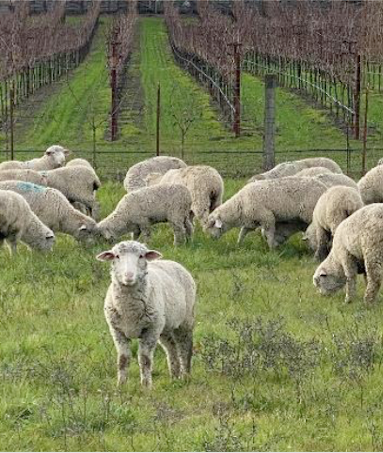

```{r setup, include=FALSE}
knitr::opts_chunk$set(echo = FALSE)
```

## Dissertation Outline {.smaller .build}
**Theme:** *Influence of human activity on landscapes and predator-prey interactions*

- Ch. 1: Rapid islandization of Earth's protected areas (*In Prep*)
- Ch. 2: Habitat edges drive animal movement in protected areas (*TBD*)
- Ch. 3: The influence of human activity on predator-prey interactions (*In Review*)
- Ch. 4: **Characterizing coyote resource selection in human-modified landscapes** (*Analysis*)

{width=25%}{width=25%}{width=25%}{width=25%}

## Research Objectives

Characterize the drivers of coyote behavior and resource selection at an active sheep ranch. 

{width=60%}{width=34%}

## Data Collection {.smaller}
<div style="float: left; width: 60%;">
**Dataset:**

- 2 field seasons, December - March
- 8 coyotes, 1-hour fix rate
- 4 guardian dogs, 10-min fix rate 

**Notes:**

- Lambs in pasture February - March
- Grapes in season August - November
</div>

<div style="float: right; width: 40%;">
{width=80%}
</div>

## Coyote Home Ranges {.smaller}

These are the 95% Kernel Utilization Distributions for 2 seasons of coyotes (n = 9).

```{r include=F, echo=F, message=F, warning=FALSE, fig.width=6}
library(tidyverse)
library(sf)
library(adehabitatHR)
library(tmap)

#read HREC boundary 
hopland <- st_read("/Users/Amy/Documents/Berkeley Classes/Brashares Lab/projects/coyote-movement/data_covariates/HREC_boundary/HREC_boundary.shp") %>% st_transform("+init=epsg:4326") %>% st_transform("+init=epsg:26910")
#convert geometry
hopland <- st_geometry(hopland)
#Load KUD
load(file = "kud_coyote.Rdata")
#set as sf object
hr <- st_as_sf(kud_contour) %>% 
  filter(id!="C6") %>% 
  mutate(season = c(rep("2020-2021", 4), rep("2021-2022", 4)),
         sex = c("female","female","male","male",
                 "male","female","male","female"))
#partition
Season_1 <- hr[hr$season=="2020-2021",]
Season_2 <- hr[hr$season=="2021-2022",]
```

<center>
```{r message=F}
#map
ttm()
tm_shape(Season_1) +
  tm_polygons(col = "MAP_COLORS", palette="Set3", alpha = 0.5) +
tm_shape(Season_2) +
  tm_polygons(col = "MAP_COLORS", palette="Set3", alpha = 0.5) + 
tm_shape(hopland) +
  tm_borders() +
tm_basemap("Esri.WorldTopoMap") + 
tm_view(set.view = 11)
```
</center>


## Covariates {.smaller}

There are several environmental variables that may influence coyote resource selection, including:

```{r echo=F, message=F, warning=F}
library(knitr)
library(kableExtra)
df <- data.frame(
  Physical = c("Land use", "Slope", "Elevation", "Distance to water"),
  Other = c("Day/Night", "Lamb presence", "Guard Dog home range", "Grape presence"))

kable(df) %>% kable_styling(full_width = T, bootstrap_options = c("striped")) %>%
row_spec(0, font_size=30) 
```

## Covariates {.smaller}

```{r include = FALSE, echo=F, message=F, warning=F}
library(sf)
library(raster)
library(tmap)

#read HREC boundary 
hopland <- st_read("/Users/Amy/Documents/Berkeley Classes/Brashares Lab/projects/coyote-movement/data_covariates/HREC_boundary/HREC_boundary.shp") %>% st_transform("+init=epsg:4326")
hopland <- st_geometry(hopland)

#add covariates
r <- list.files(path="/Users/Amy/Documents/Berkeley Classes/Brashares Lab/projects/coyote-movement/data_covariates", pattern='tif$', full.names=TRUE)[c(2,3,5,8,9,11)]
e <- lapply(r, raster::stack)
names(e) <- c("dogs", "elev", "lu", "road", "slope", "water")

#plots
p0 <- tm_shape(e[[1]]) + tm_raster(style = "cont",palette = "Spectral") + 
  tm_shape(hopland) + tm_borders(col = "black") + tm_layout(legend.show = F,title='Distance to dogs',legend.outside = T,title.position=c("center",'top'))

p1 <- tm_shape(e[[2]]) + tm_raster(style = "cont",palette = "Spectral") + 
  tm_shape(hopland) + tm_borders(col = "black") + tm_layout(legend.show = F,title='Elevation',legend.outside = T,title.position=c("center",'top'))

p2 <- tm_shape(e[[3]]) + tm_raster(style = "cont",palette = "Spectral") + 
  tm_shape(hopland) + tm_borders(col = "black") + tm_layout(legend.show = F,title='Land Use',legend.outside = T,title.position=c("center",'top'))

p3 <- tm_shape(e[[4]]) + tm_raster(style = "cont",palette = "Spectral") + 
  tm_shape(hopland) + tm_borders(col = "black") + tm_layout(legend.show = F,title='Distance to Road',legend.outside = T,title.position=c("center",'top'))

p4 <- tm_shape(e[[5]]) + tm_raster(style = "cont",palette = "Spectral") + 
  tm_shape(hopland) + tm_borders(col = "black") + tm_layout(legend.show = F,title='Slope',legend.outside = T,title.position=c("center",'top'))

p5 <- tm_shape(e[[6]]) + tm_raster(style = "cont",palette = "Spectral") + tm_shape(hopland) + tm_borders(col = "black") + tm_layout(legend.show = F,title='Distance to water',legend.outside = T,title.position=c("center",'top'))
```

```{r message=F}
ttm()
tmap_arrange(p2,p1,p4,p5,p3,p0)
```

## Step Selection Functions (SSF) {.smaller}

A first pass: **Land Use**

*How do coyotes use cropland and natural areas?*

Steps inspired by Abrahms et al. 2016: 

1. Use HMM to parse into three behavioral states (resting, traveling, meandering).
2. Create a SSF for all movement data without parsing by behavior (‘combined model’)
3. Create SSFs for movement by behavior (‘behavior model’)
4. Compare

## Hidden Markov Models (HMM) {.smaller}

Hidden markov models can use distance traveled and angles between time points to infer behavioral states of animals. 

{width=75%}

{width=75%}

## Hidden Markov Models (HMM) {.smaller}

Initial parameters ranges for 3 states: 

```{r echo=F, message=F, warning=F}
library(knitr)
library(kableExtra)

df <- data.frame(
  State = c("Resting", "Meandering", "Traveling"),
  `SL_min` = c(50, 500, 1000),
  `SL_max` = c(100, 1000, 3000),
  `SD_min` = c(25, 250, 500),
  `SD_max` = c(50, 500, 1500), 
  `TA` = c(pi, pi/2, 0),
  `Conc_min` = c(0.2, 0.5, 0.7),
  `Conc_max` = c(0.5, 0.7, 3))

kable(df) %>% kable_styling(full_width = T, bootstrap_options = c("striped")) %>%
row_spec(0, font_size=20)  
```

## Hidden Markov Models (HMM) {.smaller}

Here are the parameters for the best HMM (n = 25 iterations), with the lowest AIC. 

```{r}
load(file = "best_hmm.Rdata")

print("Step Parameters:")
print(mbest$mle$stepPar)

print("Angle Parameters:")
print(mbest$mle$anglePar)
```


## Hidden Markov Models (HMM)

```{r fig.height = 3, fig.width = 5}
load(file = "best_hmm.Rdata")
plot(mbest, ask = F)
```

## Hidden Markov Models (HMM) {.smaller}

We can append the inferred state to the dataframe: 

```{r message=F}
library(tidyverse)
data <- read_csv("/Users/Amy/Documents/Berkeley Classes/Brashares Lab/projects/coyote-movement/data/dat_final_hmm.csv") 

head(data)
```

## Step Selection Functions (SSF) {.smaller}


**Model structure:** *amt::fit_issf(steps, case_ ~ landuse_end + strata(step_id_))* 

Table 1.Summary of step selection coefficients for ‘Land Use’ by behavior category (n = 7 individuals)

```{r message=F}
ssfs <- read_csv("data/ssf_landuse_full.csv")

data %>% 
  filter(ID != 'C5') %>% 
  group_by(`Behavioral State` = states) %>% 
  summarize(`Observed Steps` = sum(states)) %>% 
  mutate(`Behavioral State` = c("Resting", "Meandering", "Traveling")) %>% 
  rbind(., c("Combined", nrow(data))) %>% 
  left_join(., ssfs, by = "Behavioral State") %>% 
  kable() %>% 
  kable_styling(bootstrap_options = c("striped")) %>%
  row_spec(0, font_size=20) 
```

**Note: These standard errors are wild, and the estimates also look strange...

## Initial conclusions {.smaller}

```{r}
load("landuse_ssfs_plot.Rdata")
landuse_ssfs
```

Figure 1. Coyote selection for croplands and natural areas near Hopland, CA (n = 7). 
* indicates estimate means. 


## Next Steps 

Measure influence of:

- Guardian dogs on coyote behavior
- Lambing period on coyote resource selection
- Day / Night on habitat use 


Consider: 

- Model selection framework to test other covariates
- 3rd field season (is timing important? number of individuals?)
- Other ideas?


